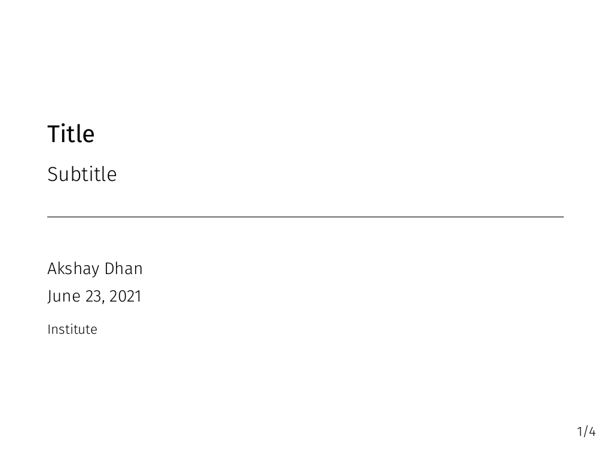
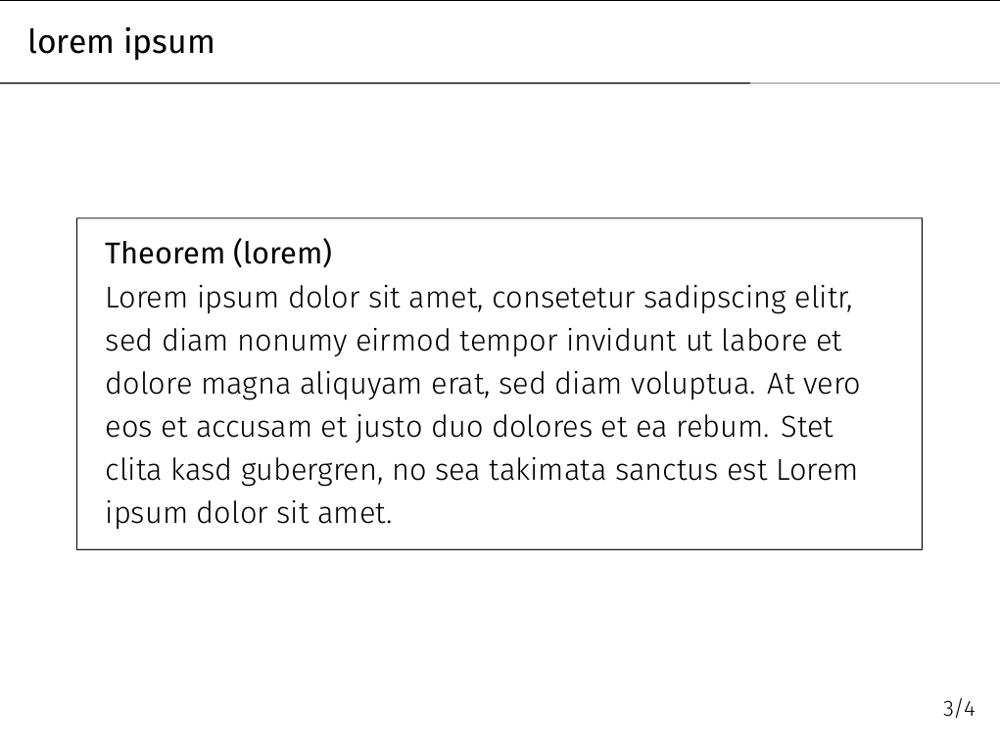
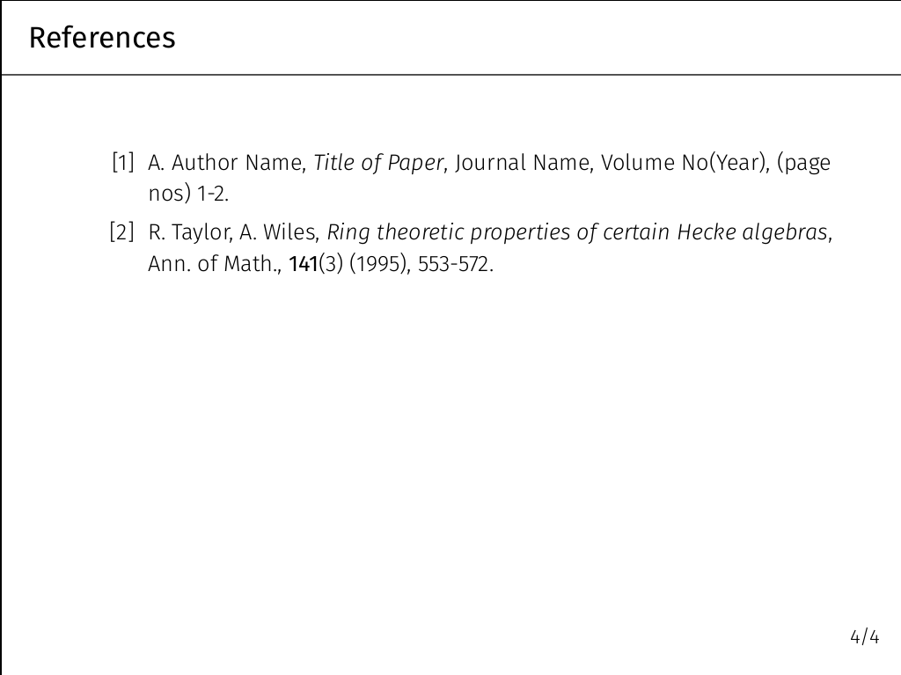

```
 _          _              _                       _       _
| |    __ _| |_ _____  __ | |_ ___ _ __ ___  _ __ | | __ _| |_ ___  ___
| |   / _` | __/ _ \ \/ / | __/ _ \ '_ ` _ \| '_ \| |/ _` | __/ _ \/ __|
| |__| (_| | ||  __/>  <  | ||  __/ | | | | | |_) | | (_| | ||  __/\__ \
|_____\__,_|\__\___/_/\_\  \__\___|_| |_| |_| .__/|_|\__,_|\__\___||___/
                                            |_|
```
# Latex Templates


## Minimal Beamer template

A minimal beamer template made using the theme [Metropolis](https://github.com/matze/mtheme).






**NOTE:** For better results use Xelatex and install firasans font.

## Article
